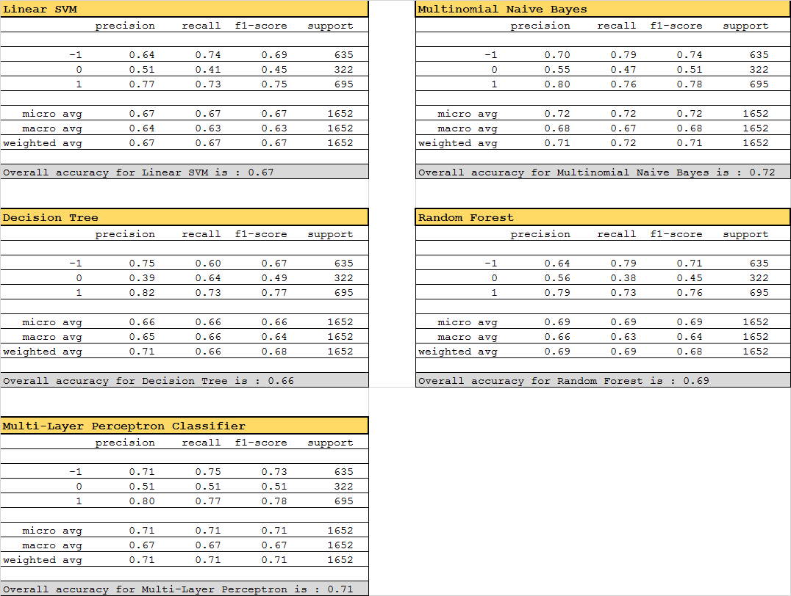

# Aspect Based Sentiment Analysis

### _1. Introduction_
Aspect based Sentiment Analysis is also known as Feature or Attribute based sentence Analysis. Aspect based sentiment analysis is used to analyze different features/attributes/aspects of product. For example smartphones, can have different features like camera, battery life, touch screen etc. So you analyze sentiments for these features for a given product.

It must also be considered that sometimes, it is not enough to say whether a post or a product review has a "positive" or a "negative" sentiment. The provider may want to know what aspects were positive or negative.

For example, let's say the customer review for a restaurant is as follows: "The food was great but the service was lousy."

The overall sentiment from a machine's perspective is "neutral" in this particular example which makes the review of no use. But if sentiment determination is done based on the aspects/features as below then the importance of the review is far more than it was in previous case: 
Aspect: "food", Polarity: "positive" 
Aspect: "service", Polarity: "negative"

### _2. Brief desctiption about the implemetation steps_
 - Read the data as pandas dataframes
 - Perform data preprocessing 
        a. replace '[comma]' with actual ','; replace multiple spaces, special characters with single space; convert into lower case; remove stopwords and tokenize
        b. consider words of sentence with window size = 5 i.e consider the sentence composed of 5 words left and right of the aspect term in the sentence along with aspect term. In case of multiple occurences of aspect term, consider 5 words left of first occurence of aspect term and five words right of last occurence of aspect term and all the words in between. In case the aspect term is missing then consider the entire sentence as it is.
        c. Learn the vocabulary dictionary and return term-document matrix using fit_transform on bigram count vectorizer
 - Sample a training set from training dataset while holding out 25% of this training data for testing (evaluating) our classifier.
 - Train the classifiers one by one this train and test data of the training dataset and obtained classification report using 10-fold cross validation
 - Pick the classifier which performed the best on this training dataset and use it to predict the class label for the given test dataset.
 - The labels generated will be written in a new text file separated by ";;" aside the "example_id" (unique id for each sentence provided as part of dataset). Also a graph representing the number of positice, negative, and neutral class predicted is plotted.

### _3. Software installations required to run code_
 - Anaconda Python distribution - prefereably Anaconda3 with python 3.6
 - pip packages imported at the top of the notebook file
 
### _4. Findings on the dataset used_
Following classification report along with overall accuracies were obtained for the classifiers used to fit the training data: 

After training, the model/classifier which performs the best on the given dataset is then used to predict class labels on the test dataset. In this case (of "Laptop" datset provided), Multinomial Naive Bayes outperformed other classifiers so prediction of labels for test dataset is done using this classifier.

### _5. References_
 - [scikit-learn ML in Python](http://scikit-learn.org/stable/user_guide.html)
 - [Natural Language Toolkit](https://www.nltk.org/py-modindex.html)
 - [Matplotlib](https://matplotlib.org/gallery/lines_bars_and_markers/barchart.html)
 - [Pandas](http://pandas.pydata.org/pandas-docs/stable/)